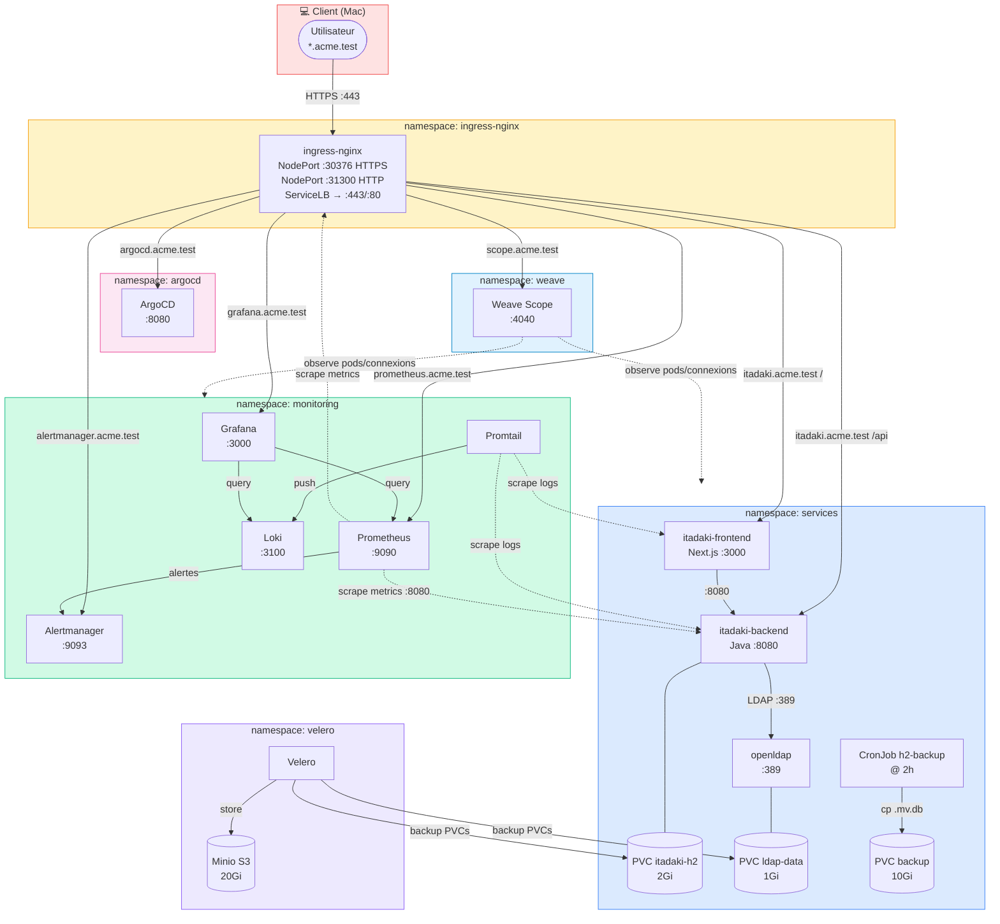
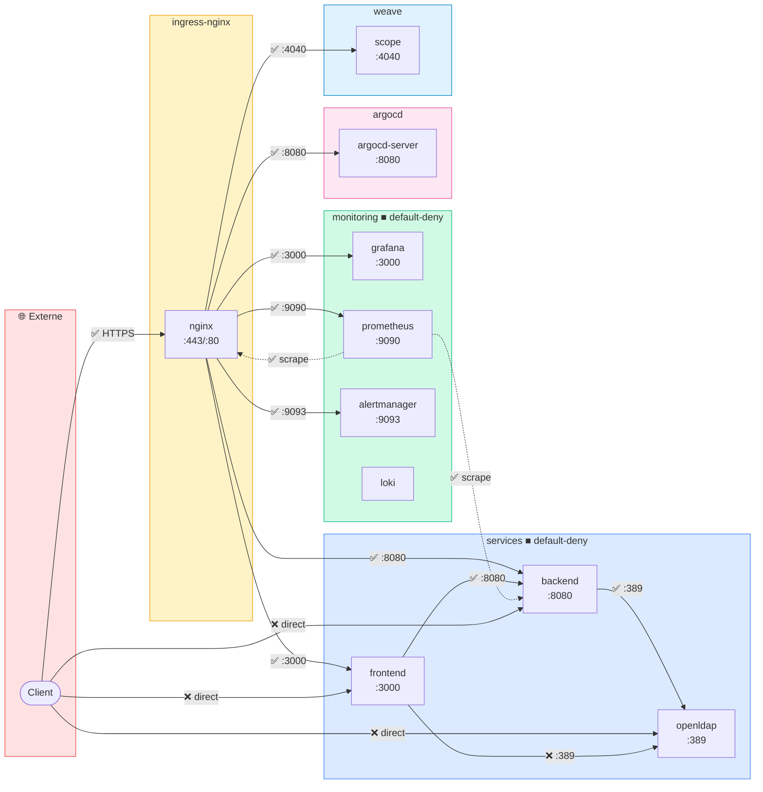

# Architecture — ACME Corp Hackathon (Itadaki)

## Stack déployée

| Couche | Technologie | Namespace |
|--------|-------------|-----------|
| CNI | Flannel (K3s défaut) | cluster-wide |
| Réseau secondaire | Multus (macvlan sur eth0) | cluster-wide |
| Visualisation réseau | Weave Scope :4040 | weave |
| Ingress controller | ingress-nginx (NodePort → LoadBalancer) | ingress-nginx |
| TLS | cert-manager + ca-issuer (self-signed CA) | cluster-wide |
| Frontend | Next.js :3000 | services |
| Backend | Java Spring Boot :8080 | services |
| Base de données | H2 (fichier persistant sur PVC) | services |
| Annuaire | OpenLDAP :389 (StatefulSet) | services |
| Logs | Loki + Promtail | monitoring |
| Métriques | Prometheus + Grafana + Alertmanager | monitoring |
| GitOps | ArgoCD | argocd |
| Backup K8s | Velero + Minio S3 | velero |

## URLs exposées via Ingress

| Service | URL | Port backend |
|---------|-----|-------------|
| Itadaki (app) | `https://itadaki.acme.test` | frontend:3000 / backend:8080 |
| Grafana | `https://grafana.acme.test` | :3000 |
| Prometheus | `https://prometheus.acme.test` | :9090 |
| Alertmanager | `https://alertmanager.acme.test` | :9093 |
| ArgoCD | `https://argocd.acme.test` | :8080 |
| Weave Scope | `https://scope.acme.test` | :4040 |

> DNS : entrée wildcard dans `/etc/hosts` → IP du nœud K3s (`make hosts`)
> Ingress-nginx : NodePort 30376 (HTTPS) / 31300 (HTTP), exposé via K3s ServiceLB

## Schéma d'architecture général

## Flux réseau & NetworkPolicies

## NetworkPolicies

| Règle | Source | Destination | Port | Namespace |
|-------|--------|-------------|------|-----------|
| allow-internet-to-ingress | 0.0.0.0/0 | ingress-nginx | 80, 443 | dmz |
| allow-dmz-to-itadaki-frontend | ingress-nginx | itadaki-frontend | 3000 | services |
| allow-dmz-to-itadaki-backend | ingress-nginx | itadaki-backend | 8080 | services |
| allow-frontend-to-backend | itadaki-frontend | itadaki-backend | 8080 | services |
| allow-backend-to-ldap | itadaki-backend | openldap | 389 | services |
| allow-monitoring-scrape | monitoring | services + dmz | 8080, 9100 | services |
| allow-ingress-to-grafana | ingress-nginx | grafana | 3000 | monitoring |
| allow-ingress-to-prometheus | ingress-nginx | prometheus | 9090 | monitoring |
| allow-ingress-to-alertmanager | ingress-nginx | alertmanager | 9093 | monitoring |
| allow-ingress-to-argocd | ingress-nginx | argocd-server | 8080 | argocd |
| allow-ingress-to-weave-scope | ingress-nginx | weave-scope-app | 4040 | weave |
| default-deny-all | — | dmz, services, monitoring | tout bloqué | * |

## Persistance des données

| Donnée | PVC | Taille | Survit à la suppression |
|--------|-----|--------|------------------------|
| H2 (Itadaki) | `itadaki-h2-pvc` | 2Gi | Oui |
| LDAP data | `ldap-data-openldap-0` | 1Gi | Oui |
| LDAP config | `ldap-config-openldap-0` | 100Mi | Oui |
| Backup H2 | `backup-pvc` | 10Gi | Oui |
| Loki logs | PVC Helm loki-stack | 5Gi | Oui |
| Minio (Velero) | `minio-pvc` | 20Gi | Oui |
